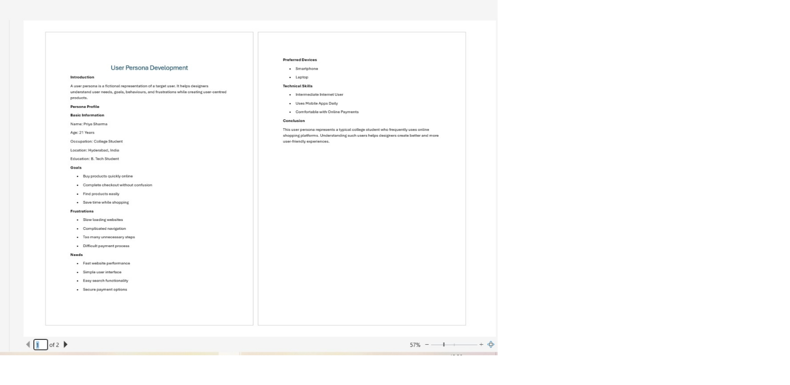

# CODTECH UI/UX Internship Task-1

## User Persona Development

Company: CODTECH IT SOLUTIONS

Intern Name: TALLAM HARIKA

Intern ID: CITS2799

Domain: UI/UX Design

Duration: 8 Weeks

Mentor Name:Neela Santhosh Kumar

## Objective

The objective of this project is to create a detailed user persona representing a target user. This helps designers understand user needs, goals, frustrations, and behaviors to build better user experiences.

## Description

This project focuses on developing a fictional user persona for an online shopping application. The persona includes demographic information, goals, pain points, user needs, and device preferences.

## Persona Details

* Name: Priya Sharma
* Age: 21
* Occupation: College Student
* Goals: Quick online shopping, easy checkout
* Frustrations: Slow websites, complex navigation
* Needs: Fast loading pages, simple user interface

## Tools Used

* Figma / Canva / Microsoft Word

## Files in Repository

* User Persona Report.pdf
* Persona Design.png
* README.md

## Conclusion

This project successfully demonstrates how user personas help designers understand target users and create user-centered design solutions.

## Proof of Execution

### User Persona Report Screenshot

### GitHub Repository Screenshot

### Proof 3 – GitHub Repository Upload

### User Avatar

